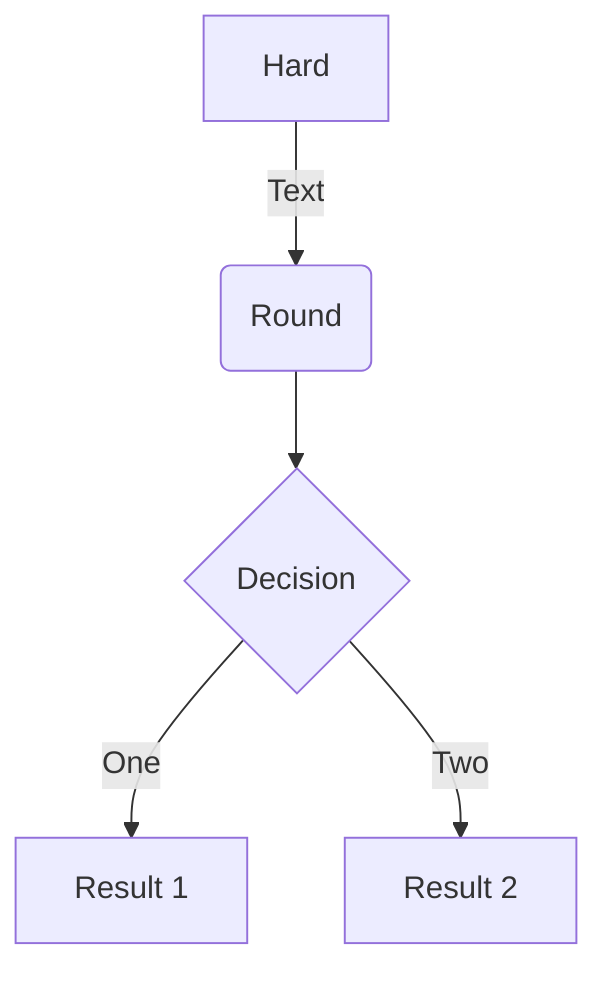

# Demo [gRPC](https://grpc.io/)
- gRPC is a modern open source high performance Remote Procedure Call (RPC) framework that can run in any environment
- Define service using Protocol Buffers, a powerful binary serialization toolset and language
- Automatically generate idiomatic client and server stubs for your service in a variety of languages and platforms
- Install runtime and dev environments with a single line and also scale to millions of RPCs per second with the framework
- Bi-directional streaming and fully integrated pluggable authentication with HTTP/2-based transport

## [gRPC for .NET](https://github.com/grpc/grpc-dotnet)
- [gRPC for .NET Examples](https://github.com/grpc/grpc-dotnet/tree/master/examples)
- [Tutorial: Create a gRPC client and server in ASP.NET Core](https://docs.microsoft.com/en-us/aspnet/core/tutorials/grpc/grpc-start?view=aspnetcore-6.0&tabs=visual-studio)

## What is Protobuf (Protocol Buffers)?
- Protocol buffers, usually referred as Protobuf, is a protocol developed by Google to allow serialization and deserialization of structured data. 

## What is gRPC and Protobuf?
- Protobuf is the most commonly used IDL (Interface Definition Language) for gRPC. It's where you basically store your data and function contracts in the form of a proto file.

